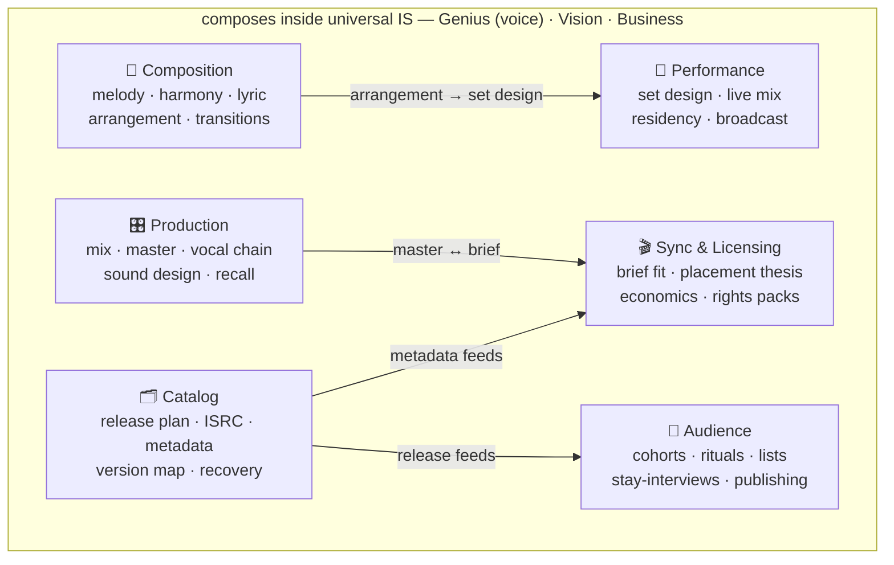

# 🎼 Music Intelligence Systems

### A sovereign domain sub-stack for sound practiced as a compounding catalog

> Sound as the science of sustained listening — and the architecture of a catalog
> that compounds. Six sub-systems (Composition · Production · Catalog · Performance ·
> Audience · Sync) composed into one cohesive, research-grounded intelligence stack.
> Refuses the loudness war and the AI-vocal-impersonation grift.

[**🎚️ The six sub-systems**](#six-sub-systems) · [**🧠 The synthesis edge**](#synthesis-edge) · [**👤 Who it's for**](#who-its-for) · [**🗺️ Where it sits**](#where-it-sits)

---

> [!NOTE]
> **Status — charter (v0.1).** This repo is the public home for the Music / Sound Intelligence
> vertical. The canonical reference implementation currently lives inside
> [`Starlight-Intelligence-System/verticals/sound-intelligence`](https://github.com/frankxai/Starlight-Intelligence-System)
> and migrates here as the vertical stabilizes. This README is the contract; the sub-system
> code lands incrementally. No shipped runtime is claimed in this repo yet.

---

## 🎯 What this is

Music Intelligence is the **forkable practitioner reference** — the wrapper that ties six
sub-systems into one cohesive intelligence stack for sovereign sound practitioners. You don't
run it as a single agent; you run six sub-systems that share a voice, a research grounding, and
a refusal posture. This vertical is the contract that holds them together.

Sovereign sound practitioners fork it into their own private repo (via `/sovereign-spawn` or
`/spawn-domain-stack`) and shape it to their voice, their catalog, their releases, their
fanbase, their sync placements. The operated instance (Arcanea Records) is private and is **not**
this public reference.

---

## 🧠 The synthesis edge

Most music advice runs on one of three modes: (1) the recycled producer-influencer playbook;
(2) the major-label A&R framework, applied without major-label distribution behind it; (3) the
indie-mythology zine — "just make great art" — as if catalog architecture, sync economics, and
audience compounding were beneath the work. None survive a real release cycle for a working
practitioner with a back catalog and a calendar.

This vertical assumes a different synthesis: **composer + producer + audio engineer + a decade of
catalog and release operations + literacy in music theory, the cognitive science of listening,
and the business of sync licensing.** Composition is architecture, not feel. Production is
decisions about how a listener's nervous system experiences the work — what fatigues, what
sustains. Metadata is load-bearing infrastructure, not paperwork. Sync literacy turns a back
catalog from sunk cost into compounding revenue. Every sub-system inherits that synthesis.

---

## 🎚️ The six sub-systems

| Sub-system | Domain | Posture |
|---|---|---|
| **Composition** | Songwriting · melody · harmony · lyric · arrangement architecture · transition design | Architecture over feel |
| **Production** | Mix planning · master planning · vocal chain · sound design · session recall | The listener's nervous system, by design |
| **Catalog** | Release planning · ISRC minting · metadata · version mapping · deplatform recovery | Metadata as infrastructure |
| **Performance** | Set design · audience contract · live mix · residency · broadcast prep | Tension-and-release across a set |
| **Audience** | Cohort mapping · ritual design · list architecture · stay interviews · sovereign publishing | No release into a vacuum |
| **Sync & Licensing** | Brief fit · placement thesis · license economics · rights pack · sync stay-interview | Catalog as compounding revenue |

The sub-systems share artifacts horizontally: Composition's arrangement logic transfers to
Performance's set design; Catalog's metadata discipline expresses through Sync, Audience, and
Performance; Production's mix-master decisions compose with Sync's brief fit.

---

## 👤 Who this is for

- **Sovereign sound practitioners** running their own catalog — fork this, shape it to your voice, run release cycles through it.
- **Independent labels and artist collectives** wanting a research-grounded operating layer above their distribution and PRO infrastructure — not a DAW replacement, not a distribution system; the thinking layer above them.
- **Composers and producers** productizing their methodology — the scaffold for moving from project work to a body of practice you can teach, license, and operate without burning out the source.
- **Practitioners who keep shipping releases that don't compound** — calendar full, streams flat, sync pipeline empty — who want a diagnostic before buying the next mastering chain or marketing course.

**Not** for: viral-hit formulas, algorithm-gaming playbooks, or generic content schedules. The vertical refuses those by design.

---

## 🗺️ Where this sits

Tier: **domain sub-stack (vertical) under SIP** — a reference for `/spawn-domain-stack`. It composes
*inside* the universal Intelligence Stack: **Genius IS** (voice — every announcement, fan email, and
sync pitch runs through the practitioner's voice), **Vision IS** (the catalog reads as a body of work,
not disconnected releases), and **Business IS** (entity, splits, PRO strategy). Universal layers
compose first; sub-systems run inside them.

---

## 📜 License & attestation

- **Substrate-aligned reference patterns** (file-contract shape, command structure, attestation format): **MIT**.
- **Vertical-specific content** (a practitioner's compositions, masters, voice samples, productized methodology, client-shaped artifacts): the practitioner's IP. Forking the scaffold transfers no rights to anyone's content.
- **Cross-party artifacts** ship with `/sip-attest` carrying "Built on SIP"; audio artifacts use `/sip-attest-audio` for embedded EXIF/XMP attestation.

Sovereignty clause (SIP § 5) is non-waivable. Starlight has no ownership claim on practitioner verticals forked from this reference.

---

**Built on SIP** · Starlight Intelligence Protocol · MIT · _Refuses the loudness war._

