# SYSTEM.md — the Agentic Music Producer's OS, in one map

> Read this first. It is the index; the depth lives in the four linked docs below. Every fact here
> is sourced from files already in this repo (or the sibling repos it composes) — nothing here is
> aspirational unless a status label says so.

## What this is

The Music Intelligence System (MIS, this hub) is the registry, schema layer, and canon-tooling that
turns "make a track" into a repeatable, agentic pipeline — from what to make, through Suno
generation, canon-binding to an Arcanea Guardian, mastering, sequencing into an album, cover/video
generation, release, and monetization — composed out of agents and tools that mostly already exist
across six sibling repos, plus one deliberate missing hinge (the approval→brief step) that the
roadmap builds next.

## The 12-module value chain

Twelve modules, five stages, one learning loop back to the start. Status labels are load-bearing —
most of the chain is built, including module 8 as of 2026-07-08 (`FrankX/.claude/agents/music-brief-writer.md`
+ a proven fixture at `FrankX/briefs/ocean-chorus.yaml`); the remaining known gap is real-catalog
sunoId identity — the fixture uses a placeholder id, not yet exercised against a live catalog entry.

```mermaid
flowchart LR
  classDef built fill:#cdeccd,stroke:#2f7a2f,color:#123
  classDef partial fill:#fde9b8,stroke:#b8860b,color:#332
  classDef gap fill:#f6c6c6,stroke:#a33,color:#311

  subgraph INTEL["INTELLIGENCE"]
    ideate["1 Ideate<br/>vibe-os states + CANON.md + trend intel"]:::partial
    promptsci["3b Prompt science<br/>suno-prompt-architect"]:::built
  end

  subgraph GEN["GENERATION"]
    generate["2 Generate<br/>Suno + Claude-in-Chrome loop"]:::partial
    capture["3 Capture<br/>Drive intake folder"]:::built
  end

  subgraph POST["POST-APPROVAL"]
    catalog["4 Catalog<br/>music-catalog-indexer"]:::built
    canontag["5 Canon-tag<br/>tag-vibe-profile.mjs"]:::built
    qc["6 QC / master<br/>music-mastering-qc (ffmpeg)"]:::built
    sequence["7 Sequence<br/>album-builder.mjs"]:::built
    brief["8 Brief ★<br/>music-brief-writer — BUILT (sunoId-identity fixes pending)"]:::partial
  end

  subgraph DIST["DISTRIBUTION"]
    coverviz["9 Cover + Video<br/>Higgsfield / NB2 / Remotion"]:::partial
    publish["10 Publish<br/>music-release-manager"]:::built
    socialdist["11 Distribute social<br/>postiz / content-social-distributor"]:::partial
  end

  subgraph MON["MONETIZATION"]
    monetize["12 Monetize<br/>streaming, sync, products, ads, NFT-gated"]:::partial
  end

  ideate --> generate
  promptsci --> generate
  generate --> capture
  capture --> catalog --> canontag --> qc --> sequence --> brief
  brief --> coverviz
  brief --> publish
  brief --> socialdist
  coverviz --> publish
  publish --> monetize
  socialdist --> monetize
  monetize -. "learning loop: keep-rate biases next ideate/prompt cycle" .-> ideate
  monetize -. " " .-> promptsci
```

Source of the module inventory, statuses, and the "brief is the hinge" argument:
`docs/AGENTIC-MUSIC-INTELLIGENCE-BLUEPRINT.md` §1–3. The brief (module 8) was the single
highest-leverage build because five downstream modules (9, 10, 11, and the monetization surfaces in
12) all read it — see that doc's §3 for the exact contract. It shipped 2026-07-08
(`@music-brief-writer`); the open item is wiring it against real catalog sunoIds instead of the
`briefs/ocean-chorus.yaml` fixture's placeholder id.

## Repo map — who owns what

| Repo | Role | Owns |
|---|---|---|
| **music-intelligence-systems** (this repo) | Hub | Registry (`registry/*.json`), schemas, canon-tagging + album tooling (`tools/`), the two `/si` engineering specs, this map, the eval harness (`evals/music/`) |
| **vibe-os** | Engine | The state-change science layer: 15-state vibe library, MCP server (`generate_vibe_prompt`, `generate_transition_prompt`, …), `frequency-generator-pro.py`, `vibe-os-mixer.py`, ISO-principle transition logic |
| **FrankX** | Production (agents + catalog) | The 9-agent Music Production pillar (producer, suno-mastery, suno-prompt-architect, create-wizard, catalog-indexer, mastering-qc, licensing, release-manager, video-batch), the 12k+ track catalog (`data/music-asset-registry.json`) |
| **Starlight-Intelligence-System** | Substrate | Arcanea label CANON.md (Guardian roster, frequencies, modes, mastering posture — read-only from this hub), the `sound-intelligence` vertical (6 agents, 30 commands) and `music-is` vertical (7 agents: curator, archivist, persona-keeper, distributor, amplifier, royalty-architect, producer) |
| **ai-music-academy** | Education | 4-tier curriculum, 6 portable teaching/production personas |
| **frankx.ai-vercel-website** | Public surface (website) | `/music-intelligence` hub page, `/music/templates`, `/music-lab` (8 free instruments), `/vibe` product page |

Full contracts and data-flow diagram: `ECOSYSTEM.md` (this repo). Machine-readable mirror:
`registry/repos.json`.

## Agent + tool inventory

32 agents in `registry/agents.json`, by tier:

| Tier | Repo | Count | Examples |
|---|---|---|---|
| `hub-canonical` | music-intelligence-systems | 5 | lyric-writer, film-sync-composer, music-theory-teacher, orchestration-architect, swarm-orchestrator |
| `pillar-2` | FrankX | 9 | music-producer, music-suno-prompt-architect, music-suno-mastery, music-create-wizard, music-catalog-indexer, music-mastering-qc, music-licensing, music-release-manager, music-video-batch |
| `sound-intelligence` | Starlight-Intelligence-System | 6 | starlight-sound-composition, -production, -catalog, -performance, -audience, -sync |
| `music-is` | Starlight-Intelligence-System | 7 | music-curator, music-archivist, persona-keeper, music-producer-label, music-distributor, music-amplifier, royalty-architect |
| `engine` | vibe-os | 1 | vibe-os-master |
| `academy` | ai-music-academy | 3 | academy-teaching-assistant, academy-music-producer, academy-content-creator |
| `workflows` | agentic-creator-os | 1 | acos-music-production |

Tools + MCP servers in `registry/tools.json` (14 entries): `vibe-os-mcp-server` (7 MCP tools),
`vibe-prompt-generator`, `frequency-generator-pro`, `vibe-os-mixer` (all vibe-os, shipped); `tag-vibe-profile.mjs`
and `album-builder.mjs` (this hub, shipped this cycle); `export-agents.mjs`, `validate-registry.mjs`
(this hub); `create-music-command` (FrankX), `sound-commands` + `music-is-commands` (Starlight,
30 + 7 slash commands); `music-lab` (website, 8 free instruments); `music-catalog-mcp` (specified,
not yet built — see `mcp/README.md`).

## Tool routing (native vs. frontier)

Every generation job — cover, video, audio layer, master — is routed by a single decision matrix:
native CLI (`nb-generate`, Remotion, ffmpeg, vibe-os's `frequency-generator-pro.py`) is the default for
everything, and Higgsfield (frontier, credit-metered) is reserved for exactly three justified cases —
Guardian identity persistence across a set, real cinematic motion, and shots native genuinely can't
fake. See `docs/MEDIA-TOOLING-DOCTRINE.md` for the full matrix and rationale; this file doesn't
duplicate it.

## Deeper docs

- `specs/music-md/SPEC.md` — **MUSIC.md v0.1**: the proposed agent-readable music context file
  standard (identity, lineage, rights, assets, measured-vs-declared), dogfooded at
  `albums/example-album/MUSIC.md`.
- `docs/AGENTIC-MUSIC-INTELLIGENCE-BLUEPRINT.md` — the full 12-module value chain, the honest
  three-actor boundary map (Claude Code / Claude-in-Chrome / Container Playwright), the ordered
  roadmap, and monetization status.
- `docs/MEDIA-TOOLING-DOCTRINE.md` — the native-vs-frontier decision matrix and per-asset routing.
- `docs/engineering/2026-07-album-os.md` — the Album OS proposal: the 8-stage pipeline, the
  canon-tagging scoring model, sequencing/arc heuristics, and the album manifest schema.
- `vibe-os/docs/engineering/2026-07-suno-ecosystem-bridge.md` — how generation actually happens
  without a Suno API: the hybrid bridge (Drive intake + Claude-in-Chrome companion + watch-folder),
  and why an unofficial API wrapper is rejected as a default.
- `WORKFLOW.md` (this repo) — the operational loops: how a track actually moves from idea to
  release, day to day.
