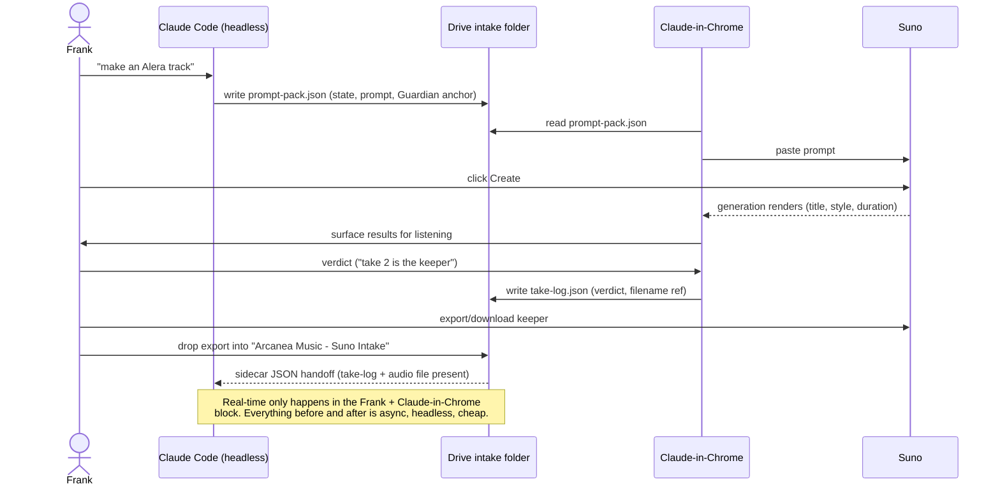
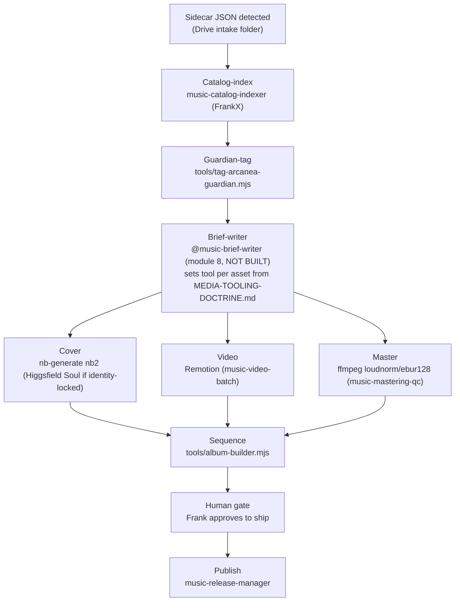

# WORKFLOW.md — the operational loops

> How the system in `SYSTEM.md` actually runs, day to day. Four loops: generate, ingest→build, the
> daily cadence, and eval/optimize. Grounded in `docs/AGENTIC-MUSIC-INTELLIGENCE-BLUEPRINT.md` §7,
> `vibe-os/docs/engineering/2026-07-suno-ecosystem-bridge.md`, and
> `docs/engineering/2026-07-album-os.md`.

## Loop A — Generate (Cowork ↔ Suno ↔ Drive)

Two Claude contexts that never share memory — the only channel between them is a small structured
file in the Drive intake folder ("Arcanea Music — Suno Intake",
`1iF8qP5m31K6X7WfbCof6dOBQdlfes-aB`). This is the design, not a limitation: Claude Code (headless)
cannot reach a browser; Claude-in-Chrome cannot run unattended. The handoff is always a file, never a
live feed.

Frank does taste and two clicks (Create, Download). Suno does rendering. Everything else — prompt
science, bookkeeping, capture, mastering, sequencing, learning — is agent work.

## Loop B — Ingest → Build

Triggered once, by the sidecar JSON landing in the intake folder — never by watching the folder
continuously. Each stage names its real owning agent or tool.

Notes on the real stages (per `docs/engineering/2026-07-album-os.md` §2 and
`docs/AGENTIC-MUSIC-INTELLIGENCE-BLUEPRINT.md` §3):

- **Catalog-index** and **Guardian-tag** are fully built and deterministic (no LLM calls in the
  tagger — see `tools/tag-arcanea-guardian.mjs`).
- **Brief-writer** is the one gap in this loop. Until it exists, the tool-routing decisions in
  `docs/MEDIA-TOOLING-DOCTRINE.md` are applied by hand per asset.
- **Cover / video / master** run in parallel once a brief exists — they all read the same brief,
  none depends on the others.
- **Sequence** only runs once all three parallel outputs (or at least mastering) are available for
  every track in the album.
- **Human gate** is non-negotiable: nothing auto-publishes anywhere in this system.

## Loop C — Daily operating cadence

A day in the life of the system, composing Loops A and B (per blueprint §7):

1. **Morning (headless, async):** Frank states an intent ("3-track morning arc: wake → focus →
   flow"). Agents consult the take-log for what's worked, call vibe-os's `recommend_state_for_goal` /
   `generate_transition_prompt`, and write a prompt pack to the Drive intake folder.
2. **Generation session (Frank + Claude-in-Chrome, real-time — Loop A):** Frank opens Suno next to
   the prompt pack. The Chrome companion pastes, Frank clicks Create and gives verdicts. Only this
   block is real-time; it is also the only block that can be.
3. **Post-session (headless, async — Loop B):** Downloads sync to the intake folder. Catalog-index,
   Guardian-tag, mastering-QC, sequencing run. Cover/video generation follows once a brief exists.
4. **Human gate, whenever Frank is ready:** review the release manifest, approve to ship.
5. **Continuous:** the learning loop (module 12 → module 1/3) updates keep-rate stats that bias the
   next morning's prompt pack.

## Loop D — Eval & optimize

Before scaling a batch (a new album, a batch of covers, a new engine), run the eval harness at
`evals/music/` rather than trusting a single listen or a single generated asset:

- **`evals/music/RUBRICS.md`** defines four rubrics: canon-fit (0–100, mirrors the Guardian-matching
  math in `tools/tag-arcanea-guardian.mjs`), mastering-pass (LUFS-integrated gate against the
  album's `masteringTarget` window, default [-18, -16] per `schemas/album.schema.json`), cover
  brand-gate (checklist derived from the Album OS cover/visual stage), and a model A/B comparison
  template (cost / quality / brand-fit columns) for engine decisions like nb2 vs. Higgsfield Soul for
  a cover, or Remotion vs. Kling for a video.
- **`evals/music/score.mjs`** runs the first two deterministically (no LLM calls) and prints the
  brand-gate checklist result; the model-A/B rubric prints a structured template for a human or an
  LLM judge to fill in, because no generation actually happens inside this harness (see
  `evals/music/README.md`).
- **The result feeds the tool-routing decision, not the other way around:** per
  `docs/MEDIA-TOOLING-DOCTRINE.md`, native is the default; a candidate only escalates to a
  credit-metered frontier engine when it fails the rubric on the cheaper engine's output (or the job
  is one of the three doctrine-listed frontier-only cases).

## Token-efficiency — the runtime rules (load-bearing)

This is not a footnote — it is a first-class constraint on how the whole system is meant to run:

- **File-triggered, not observation.** No agent watches a browser or a folder continuously. Loop A's
  Chrome companion only acts when Frank is actively in a session; Loop B triggers once, on the
  sidecar JSON landing — never a polling loop. Per
  `docs/AGENTIC-MUSIC-INTELLIGENCE-BLUEPRINT.md` §1: continuous observation costs 100k+
  tokens/session for no benefit; checkpoint capture costs a few hundred tokens, once.
- **Native-default generation.** Per `docs/MEDIA-TOOLING-DOCTRINE.md`: native CLI (compute cost only)
  is the default for every asset; Higgsfield (credit-metered, real spend) is reserved for the three
  justified cases. Volume work never routes to a metered engine by default.
- **Batch where possible.** 12k+ catalog lyric videos run through the Remotion loop
  (`music-video-batch`), not 12,000 individual frontier credit spends. Batch is the default shape for
  anything at catalog scale.
- **Eval picks the cheapest passing model.** Loop D runs the rubric against the native engine's
  output first; only escalate to frontier if the native output fails the gate. Never generate on both
  engines "to compare" as a default habit — that doubles spend for a decision the rubric can make
  from one candidate plus the doctrine's stated escalation triggers.
- **Subagents for parallel build.** Once a brief exists, cover/video/master dispatch in parallel
  (swarm pattern, same deterministic routing as `tools/swarm-router.mjs`) rather than serially — this
  is a wall-clock optimization, and it does not increase total token spend since each subagent still
  only touches its own asset.
